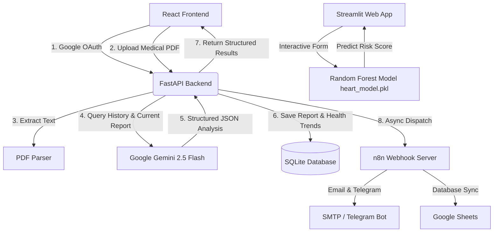

<div align="center">
  
  <h1>Heart AI System 🫀</h1>
  <h3><i>Advanced Health Analytics, Predictive Intelligence, & Autonomous Agent Ecosystem</i></h3>
  <p><b>Proudly participating in GirlScript Summer of Code (GSSoC) 2026!</b></p>
  <p>
    <a href="https://gssoc.girlscript.tech/"></a>
    <a href="https://gssoc.girlscript.tech/"></a>
    <a href="https://gssoc.girlscript.tech/"></a>
    <a href="https://github.com/Prashant-Singh-Rawat/Tony-AI-Health-Analysis-System/blob/main/LICENSE"></a>
  </p>
</div>

---

## 📋 Table of Contents
1. [Overview](#-overview)
2. [Key Features](#-key-features)
3. [Autonomous AI Agents & MCP Architecture](#-autonomous-ai-agents--mcp-architecture)
4. [n8n Automation Engine](#-n8n-automation-engine)
5. [System Architecture & Workflow](#-system-architecture--workflow)
6. [Tech Stack](#-tech-stack)
7. [Codebase Structure](#-codebase-structure)
8. [Getting Started & Local Setup](#-getting-started--local-setup)
9. [Environment Configuration](#-environment-configuration)
10. [Machine Learning Model Pipeline](#-machine-learning-model-pipeline)
11. [Contributing](#-contributing)
12. [License](#-license)

---

## 🌟 Overview
The **Heart AI System** (also known as the *Tony Health Analysis System*) is a state-of-the-art health analysis platform that leverages artificial intelligence, machine learning, autonomous multi-agent orchestration, and serverless automation workflows to analyze clinical reports and provide personalized health assessments. 

Designed for both individuals and healthcare providers, the system features:
- **Generative AI Diagnostics & Vision OCR**: Automated parsing of unstructured digital PDFs, plus an **Advanced Vision OCR Pipeline** using Gemini to reliably extract clinical parameters, ranges, and reference intervals from scanned/handwritten or image-based CamScanner reports.
- **Enhanced Health Analytics Dashboard**: Incorporates a **Health Summary Bar** (providing index, status, patient info, and normal/abnormal biomarker tallies) and **6 new core health insight features** including biomarker trackers, questions to ask doctors, prioritize findings summaries, and action checklists.
- **Autonomous Multi-Agent Coordination**: Integrated Model Context Protocol (MCP) server architecture connecting specialized AI agents (including the flagship agent, **Serena**).
- **n8n Automation Webhooks**: Ten production-ready automated lifecycle workflows routing notifications to patients and doctors based on real-time risk assessments.
- **Longitudinal Trend Analysis**: Automatically compares new medical reports with historical data to track patient progress over time.
- **Predictive ML Classification**: Tabular risk assessment based on clinical metrics utilizing a Random Forest classifier.
- **Interactive UI**: A modern React-based portal with a responsive dashboard, auth integration, and medicine price lookups.

---

## ✨ Key Features
- **PDF Report Parser & Analyzer**: Upload clinical PDFs (e.g., blood tests, cardiovascular reports), parse them, and receive structured health profiles.
- **Longitudinal Trend Tracking**: Analyzes the trajectory of health metrics over time (e.g., indicating whether a condition is "Improving" or "Worsening").
- **Personalized Recommendations**: Automatically generates custom diet and exercise plans based on report findings.
- **Autonomous Agent Control**: Trigger diagnostic workflows, fetch files, query databases, or execute browser operations via Serena and the MCP system.
- **Lifecycle Workflows via n8n**: Automation alerts triggering Google Sheets logging, Telegram notifications, and email alerts for high-risk patients.
- **Google OAuth Integration**: Secure user authentication and report history isolation.
- **Standalone ML Predictor**: A Streamlit interface for instantaneous risk predictions using a trained Random Forest model.

---

## 🤖 Autonomous AI Agents & MCP Architecture

The Heart AI System incorporates an advanced **Model Context Protocol (MCP)** registry that bridges large language models (LLMs) with local tools, external resources, and autonomous subagents.

### The Agent Coordinator
An orchestrator (`backend/orchestrator/coordinator.py`) coordinates multi-agent operations. When a complex query is initialized:
1. It registers the user intent.
2. It calls the appropriate LLM provider (Gemini, OpenAI, or Claude).
3. It maps the execution to specialized MCP tools.

### Flagship Agent: Serena
**Serena** (`backend/mcp/providers/serena.py`) is our specialized automation agent. She handles autonomous workflows, linking background task execution to live user notifications. Serena listens for signals from the system and automatically runs triggers depending on the diagnostic values generated.

### Supported MCP Providers
Our registry (`backend/mcp/registry.py`) defines a series of abstraction-first providers:
- **Filesystem Provider**: Safely manages local read/write workspaces for clinical files.
- **Database Provider**: Grants agents queries over SQLite/Postgres schemas.
- **GitHub Provider**: Pulls live changes, checks issue cues, and triggers repository updates.
- **Context7 Provider**: Provides deep, semantic medical term search.
- **Browser Provider**: Orchestrates headless web sessions for real-time validation checks.
- **Serena Provider**: Connects agent decisions to n8n webhook pipelines.

---

## 🔄 n8n Automation Engine

The backend hooks directly into an **n8n** webhook server (`backend/n8n_service.py`), allowing asynchronous processing of patient lifecycle events. The pipeline triggers specific operations depending on computed risk thresholds.

```
Patient uploads PDF
      ↓
Backend analyzes with Gemini AI
      ↓
Report saved to DB
      ↓ (async, non-blocking)
n8n_service.process_report_webhooks()
      ├── /webhook/heart-ai/report-saved   → Google Sheets log
      ├── /webhook/heart-ai/high-risk-alert → Email + Telegram (if risk ≥ 70)
      └── /webhook/heart-ai/doctor-alert   → Doctor Email (if risk ≥ 85)
```

### The 10 Automated Workflows

| # | Webhook Endpoint | Trigger Condition | Actions |
|---|---|---|---|
| 1 | `/webhook/heart-ai/report-saved` | Every new report saved | Logs user metrics to a centralized Google Sheet / Notion |
| 2 | `/webhook/heart-ai/high-risk-alert` | `risk_score >= 70.0` | Sends Email and Telegram alert to patient |
| 3 | `/webhook/heart-ai/doctor-alert` | `risk_score >= 85.0` | Emails a detailed PDF clinical report to the doctor |
| 4 | `/webhook/heart-ai/user-registered` | New account sign-up | Sends a welcome email with onboarding tutorials |
| 5 | `/webhook/heart-ai/medicine-reminder` | n8n Daily Cron Job | Sends daily push notifications and email drug lists |
| 6 | `/webhook/heart-ai/workout-reminder` | Daily at 7:00 AM | Nudges the patient with their custom exercise plans |
| 7 | `/webhook/heart-ai/diet-reminder` | Daily at 8 AM and 1 PM | Provides healthy eating checklists tailored to the patient |
| 8 | `/webhook/heart-ai/weekly-summary` | Every Sunday | Generates a trend digest (risk trajectories) for the user |
| 9 | `/webhook/heart-ai/appointment-reminder` | 24 Hours before visit | Dispatches automated booking confirmation text alerts |
| 10 | `/webhook/heart-ai/emergency-alert` | `risk_score >= 95.0` | Fires immediate Twilio SMS & emergency call cascades |

---

## 🔄 System Architecture & Workflow

### Architectural Flowchart


### Detailed Workflow Steps
1. **Authentication**: Users sign in securely using Google OAuth, matching their identity in the SQL database.
2. **Report Upload**: The patient uploads a medical report in PDF format.
3. **Data Extraction & AI Processing**:
   - PyPDF2 extracts text from the document.
   - The backend retrieves the user's historical reports from the database.
   - If history exists, a comparative prompt is constructed for **Google Gemini 2.5 Flash** to perform trend analysis.
   - Gemini returns a structured JSON payload containing `disease_type`, `risk_score`, `concerns`, `exercise_plan`, `food_plan`, and `overall_status`.
4. **Data Persistence & Automation**:
   - Analysis details are stored in the database for tracking future trends.
   - An asynchronous call to `n8n_service.process_report_webhooks` evaluates the risk metrics and executes webhooks.
5. **Dashboard Rendering**: The user is presented with visual health scores, warnings, and dynamic diet/exercise recommendations.

---

## 🛠️ Tech Stack

### Frontend
- **React (Vite)**: Component-driven UI.
- **Tailwind CSS / Vanilla CSS**: Aesthetic, responsive layouts.
- **Streamlit**: Web dashboard for the offline machine learning model predictor.

### Backend & API Layer
- **FastAPI**: Fast, asynchronous Web API framework.
- **SQLAlchemy & SQLite**: ORM and relational database storage.
- **PyPDF2**: Local text extraction from PDF files.
- **Google Generative AI SDK**: Integrates `gemini-2.5-flash` for advanced report analysis.
- **HTTPX**: Non-blocking client for executing external agent tools and n8n webhooks.

### Machine Learning
- **Scikit-Learn**: Used to train the Random Forest Classifier.
- **Pandas & NumPy**: Data processing and matrix manipulation.
- **Pickle**: Serializes and loads the trained model.

---

## 📂 Codebase Structure
```text
Heart-AI-System/
├── backend/               # FastAPI Backend Service
│   ├── agents/            # Multi-agent logic wrappers
│   │   └── base.py
│   ├── mcp/               # Model Context Protocol layers
│   │   ├── base.py
│   │   ├── registry.py
│   │   └── providers/     # Specialized tools (Serena, Database, Browser)
│   ├── orchestrator/      # Multi-agent workflow coordinators
│   ├── routers/           # Sub-routers (auth, reports, hospitals)
│   ├── ai_service.py      # PDF parsing and Gemini API orchestration
│   ├── database.py        # SQLite Database connection and session management
│   ├── n8n_service.py     # n8n Webhook pipeline integrations
│   ├── main.py            # API routes and Google Auth verification
│   ├── models.py          # SQLAlchemy Models (User, Report)
│   ├── schemas.py         # Pydantic Schemas for validation
│   ├── requirements.txt   # Backend dependency list
│   └── tests/             # API Unit Tests
│
├── frontend/              # React (Vite) Frontend
│   ├── src/
│   │   ├── components/    # Reusable components (e.g., AuthModal)
│   │   ├── pages/         # Dashboard, LandingPage, MedicinePrices
│   │   ├── main.jsx       # App entry point
│   │   └── App.jsx        # Routing and global layout
│   ├── package.json       # Frontend dependencies
│   └── vite.config.js     # Vite builder config
│
├── n8n/                   # Workflow triggers & setups
│   ├── heart-ai-workflows.json
│   └── README.md
│
├── app.py                 # Streamlit ML predictor interface
├── train_model.py         # Script to train & serialize the Random Forest model
├── heart_model.pkl        # Serialized Machine Learning model (generated)
├── requirements.txt       # Global/Streamlit Python requirements
└── LICENSE                # Open-source license
```

---

## 🚀 Getting Started & Local Setup

### Prerequisites
- Python 3.10+
- Node.js (v18+)
- npm or yarn

---

### Step 1: Clone the Repository
```bash
git clone https://github.com/Prashant-Singh-Rawat/Tony-AI-Health-Analysis-System.git
cd Heart-AI-System
```

---

### Step 2: Backend Setup
1. Navigate to the backend directory:
   ```bash
   cd backend
   ```
2. Create a virtual environment and activate it:
   ```bash
   python -m venv venv
   # On Windows:
   venv\Scripts\activate
   # On macOS/Linux:
   source venv/bin/activate
   ```
3. Install dependencies:
   ```bash
   pip install -r requirements.txt
   ```
4. Run the FastAPI development server:
   ```bash
   uvicorn main:app --reload
   ```
   The backend will run on `http://127.0.0.1:8000`.

---

### Step 3: Frontend Setup
1. Open a new terminal and navigate to the frontend directory:
   ```bash
   cd frontend
   ```
2. Install the frontend dependencies:
   ```bash
   npm install
   ```
3. Launch the Vite dev server:
   ```bash
   npm run dev
   ```
   The frontend will run on `http://localhost:5173`.

---

### Step 4: Standalone Machine Learning App (Streamlit)
To interact directly with the tabular Random Forest model:
1. Ensure you are in the root directory:
   ```bash
   cd Heart-AI-System
   ```
2. Install global dependencies:
   ```bash
   pip install -r requirements.txt
   ```
3. Run the model training script (if `heart_model.pkl` is missing):
   ```bash
   python train_model.py
   ```
4. Start the Streamlit application:
   ```bash
   streamlit run app.py
   ```
   The application will open in your default browser at `http://localhost:8501`.

---

### Step 5: Start n8n locally
To enable lifecycle workflows, spin up your n8n workspace:
```bash
npx n8n
```
1. Import `n8n/heart-ai-workflows.json` into n8n.
2. Complete credential configuration for Gmail (SMTP), Telegram, or Twilio.
3. Toggle workflows to **Active**.

---

## 🔑 Environment Configuration

Create a `.env` file in the `backend/` directory to store your API keys and secrets securely:

```env
HEALTH_AI_API=your_google_gemini_api_key

# ─── n8n Webhook Configuration ───────────────────────────────────────────────
N8N_BASE_URL=http://localhost:5678
N8N_HIGH_RISK_WEBHOOK=http://localhost:5678/webhook/heart-ai/high-risk-alert
N8N_REPORT_SAVED_WEBHOOK=http://localhost:5678/webhook/heart-ai/report-saved
N8N_DOCTOR_ALERT_WEBHOOK=http://localhost:5678/webhook/heart-ai/doctor-alert

# Risk thresholds
HIGH_RISK_THRESHOLD=70.0
CRITICAL_RISK_THRESHOLD=85.0
DOCTOR_EMAIL=doctor@hospital.com
```

> [!IMPORTANT]
> Never commit your `.env` file containing sensitive keys to GitHub. It is ignored by default in the `.gitignore` settings.

---

## 🧠 Machine Learning Model Pipeline
The system utilizes a Random Forest classifier trained on diagnostic features:
- **Features (13)**: Age, Sex, Chest Pain type (cp), Resting Blood Pressure (trestbps), Cholesterol (chol), Fasting Blood Sugar (fbs), Resting Electrocardiographic results (restecg), Max Heart Rate achieved (thalach), Exercise Induced Angina (exang), ST depression (oldpeak), Slope of peak exercise ST segment (slope), Number of major vessels (ca), and Thalassemia (thal).
- **Output**: Binary classification (`1` for High Risk, `0` for Low Risk).

To retrain the model, modify `train_model.py` to use a real clinical dataset (e.g., the UCI Heart Disease Dataset) and run `python train_model.py`.

---

## 🤖 Automated Testing & CI/CD Pipeline

The project implements a comprehensive automation suite configured via GitHub Actions in [.github/workflows/ci.yml](file:///.github/workflows/ci.yml) to ensure code reliability and validate ML model integrity.

### 🧪 ML Model Sanity & Regression Tests
We have built a dedicated validation script, [test_model.py](file:///test_model.py), which runs:
- **Model Load Checks**: Ensures `heart_model.pkl` is not corrupt and can be loaded.
- **Dimension Matching**: Validates the model accepts exactly 13 medical input features.
- **Prediction Verification**: Tests synthetic low-risk and high-risk patients to ensure predictions behave logically.
- **Regression Evaluation**: Assesses classification accuracy against a validation matrix to prevent performance degradation below 80%.

To run model tests locally:
```bash
python test_model.py
```

### ⚙️ CI/CD Workflow Triggers
- **Pushes & PRs**: Runs automatically on every push or pull request to the `main` branch to prevent regression.
- **Scheduled Weekly Check**: Triggers a cron job every Sunday at 00:00 UTC to verify model integrity against code changes.
- **Manual Dispatch**: Can be run on-demand via the GitHub Actions dashboard (`workflow_dispatch`).

---

## 🤝 Contributing
This project is open-source and proudly participates in **GirlScript Summer of Code (GSSoC) 2026**!

We highly encourage:
- Custom n8n workflow additions (Notion integrations, Slack triggers).
- Multi-agent enhancements for Serena or specialized MCP tool definitions.
- Additional medical PDF parser support.
- Enhancements to the ML model and dashboard UX.

Please check our [CONTRIBUTING.md](CONTRIBUTING.md) for structural guidelines on branches, code format, and how to create a Pull Request.

---

## 📜 License
This project is licensed under the MIT License. Feel free to copy, modify, and distribute code as allowed.
