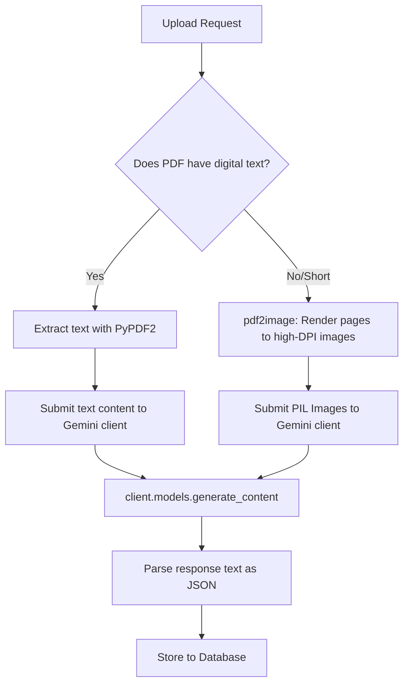
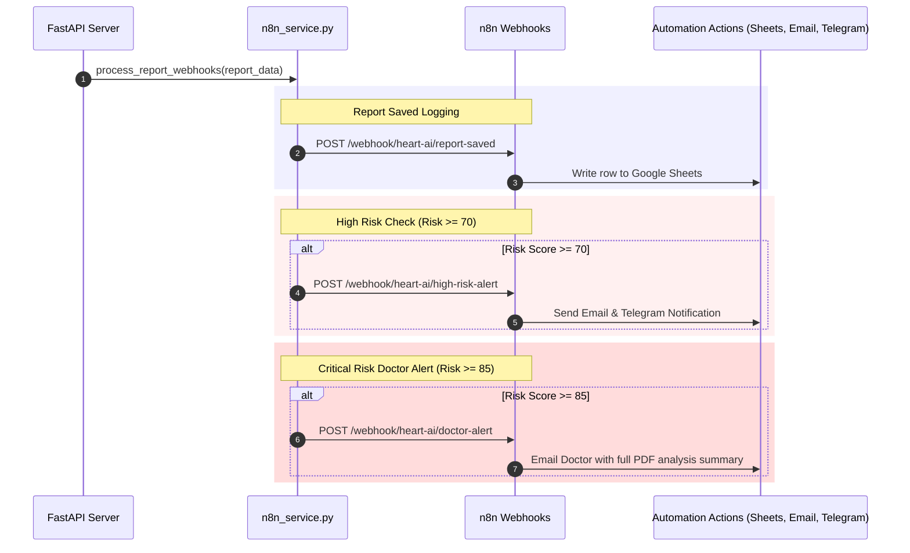

# AI Workflow and n8n Webhook Integration

This document outlines how medical documents are ingested, analyzed using Gemini, and routed to automation workflows.

---

## 1. Document Processing & Gemini Integration

The analysis engine (`backend/ai_service.py`) handles digital and scanned PDF inputs:



### Prompt Engineering and Structured Output
The prompt constraints Gemini to return structured JSON adhering to the following schema:
```json
{
  "patient_name": "string or null",
  "patient_age": "string or null",
  "extracted_parameters": [
    {
      "name": "string",
      "value": "number or string",
      "unit": "string",
      "reference_interval": "string",
      "status": "normal | high | low | abnormal"
    }
  ],
  "disease_type": "string",
  "risk_score": 0.0,
  "potential_diseases": ["string"],
  "concerns": "string",
  "exercise_plan": "string",
  "food_plan": "string",
  "overall_status": "High Risk | Moderate Risk | Low Risk | Improving | Worsening"
}
```

---

## 2. n8n Automation Workflows

Once reports are verified and saved in the database, `n8n_service.py` runs asynchronous, non-blocking webhook requests to an n8n instances.



### Environment Configurations:
*   `N8N_BASE_URL`: Base address of n8n server.
*   `N8N_HIGH_RISK_WEBHOOK`: Endpoint path for high-risk patients.
*   `N8N_REPORT_SAVED_WEBHOOK`: Endpoint logging records.
*   `N8N_DOCTOR_ALERT_WEBHOOK`: Endpoint for notifying doctors.
*   `HIGH_RISK_THRESHOLD` (Default: `70.0`)
*   `CRITICAL_RISK_THRESHOLD` (Default: `85.0`)
*   `DOCTOR_EMAIL`: Recipient doctor email.
