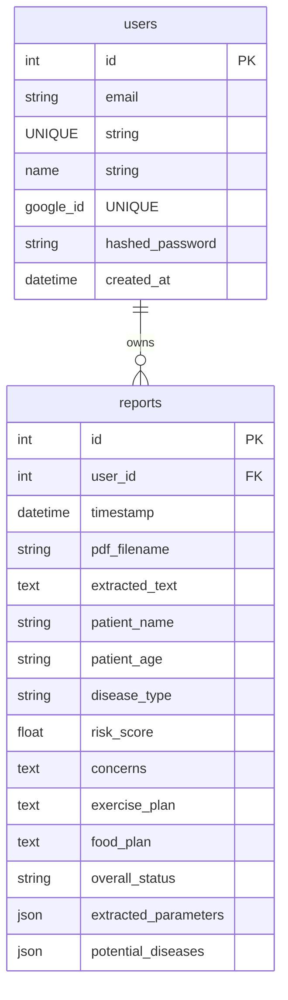
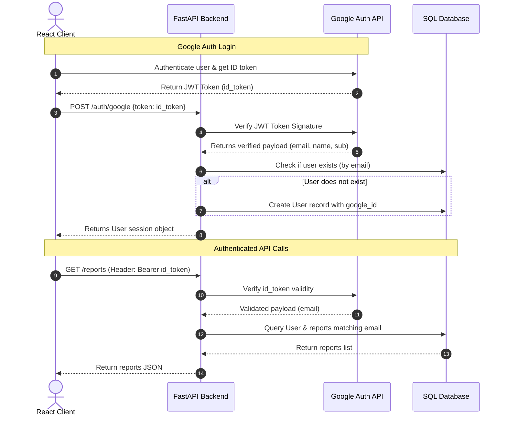

# Database and Authentication Architecture

This document describes the schema structure, data connections, and verification flows in the Tony Health System.

---

## 1. Database Schema (SQLAlchemy Models)

### Table: `users`
*   `id` (Integer, Primary Key): Unique identifier for users.
*   `email` (String, Unique): E-mail address.
*   `name` (String): Display name.
*   `google_id` (String, Nullable): Stored identifier for users authenticating via Google.
*   `hashed_password` (String, Nullable): Bcrypt password hashes for standard email/pass users.
*   `created_at` (DateTime): Registration timestamp.

### Table: `reports`
*   `id` (Integer, Primary Key): Unique identifier for reports.
*   `user_id` (Integer, Foreign Key): Maps reports to a specific user. Nullable for anonymous uploads.
*   `pdf_filename` (String): Stored filename.
*   `extracted_text` (Text): The raw text extracted directly or synthesized via visual OCR.
*   `disease_type` (String): Short categorization (e.g. "Cardiology").
*   `risk_score` (Float): Overall health risk representation (0.0 to 100.0).
*   `extracted_parameters` (JSON): A list of parsed parameters, including names, values, units, reference intervals, and status flags.
*   `potential_diseases` (JSON): List of conditions the patient might be at risk for based on parameters.

---

## 2. Authentication Flow

The backend verifies authentication through standard token validation.

